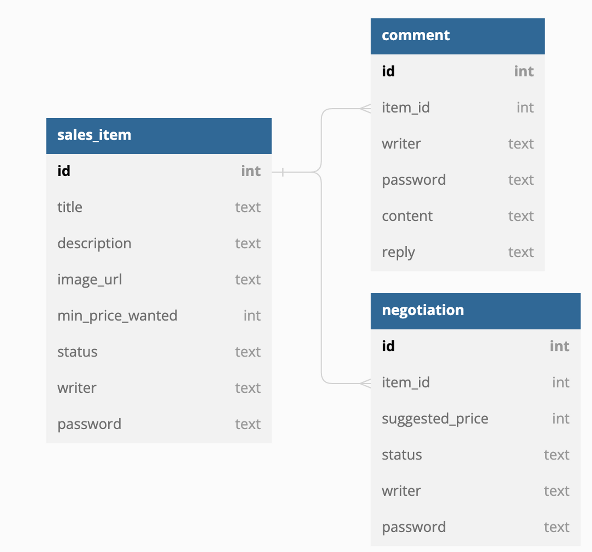

# MiniProject_Basic_KimSoyoung
> 중고 제품 거래 플랫폼을 만들어보는 미니 프로젝트

사용자가 중고 물품을 자유롭게 올리고, 댓글을 통해 소통하며, 최종적으로 구매 제안에 대하여 수락할 수 있는 형태의 중고 거래 플랫폼입니다.

## ⚙️ 사용 기술 및 개발 환경
Java, Spring Boot, IntelliJ, Sqlite

## ✅ 주요 기능
### Item
+ 사용자가 중고 거래 물품 정보를 작성하기 위해 '물품 정보 글 작성 기능'이 필요하다.
  + 반드시 포함되어야 할 내용 : 제목, 설명, 최소 가격, 작성자
  + 비밀번호 항목을 추가해서 등록
  + 최초 물품 등록 시, 물품의 상태는 __판매중__
+ 사용자가 중고 거래 물품 정보를 조회하기 위해 '물품 정보 글 조회 기능'이 필요하다.
  + 페이지 단위 조회
  + 전체 조회, 단일 조회
+ 사용자가 중고 거래 물품 정보를 수정하기 위해 '물품 정보 글 수정 기능'이 필요하다.
  + 물품이 등록될 때 추가한 비밀번호 첨부
  + 이미지 첨부 가능
+ 사용자가 중고 거래 물품 정보를 삭제하기 위해 '물품 정보 글 삭제 기능'이 필요하다.
  + 물품이 등록될 때 추가한 비밀번호 첨부
  
### Comment
+ 사용자가 물품에 대한 질문을 작성하기 위해 '댓글 작성 기능'이 필요하다.
  + 반드시 포함되어야 할 내용 : 대상 물품, 댓글 내용, 작성자
  + 비밀번호 항목을 추가해서 등록
+ 사용자가 물품에 대한 질문을 조회하기 위해 '댓글 조회 기능'이 필요하다.
  + 페이지 단위 조회
+ 사용자가 물품에 대한 질문을 수정하기 위해 '댓글 수정 기능'이 필요하다.
  + 물품이 등록될 때 추가한 비밀번호를 첨부해야 수정 가능
+ 사용자가 물품에 대한 질문을 삭제하기 위해 '댓글 삭제 기능'이 필요하다.
  + 물품이 등록될 때 추가한 비밀번호 첨부

### Proposal (Negotiation)
+ 사용자가 물품에 대하여 구매 제안을 등록하기 위해 '구매제안 작성 기능'이 필요하다.
  + 반드시 포함되어야 할 내용 : 대상 물품, 제안 가격, 작성자
  + 비밀번호 항목을 추가해서 등록
  + 구매 제안 등록 시, 제안의 상태는 __제안__
+ 사용자가 물품에 대하여 구매 제안을 조회하기 위해 '구매제안 조회 기능'이 필요하다.
  + 물품의 주인과 등록한 사용자만 조회 가능
    + 물품의 주인 : 물품 등록 시 사용한 작성자, 비밀번호 첨부
    + 페이지 단위 조회
  + 등록한 사용자 : 본인이 사용한 작성자, 비밀번호 첨부
  + 본인의 구매 제안만 조회 가능
  + 페이지 단위 조회
+ 사용자가 물품에 대하여 구매 제안을 수정하기 위해 '구매제안 수정 기능'이 필요하다.
  + 제안이 등록될 때 추가한 작성자와 비밀번호 첨부
+ 사용자가 물품에 대하여 구매 제안을 삭제하기 위해 '구매제안 삭제 기능'이 필요하다.
  + 제안이 등록될 때 추가한 작성자와 비밀번호 첨부
+ 물품의 주인이 물품에 대하여 구매 제안을 __수락 / 거절__ 하기 위해 '구매제안 수락/거절 입력 기능'이 필요하다.
  + 제안이 등록될 때 추가한 작성자와 비밀번호 첨부
  + 구매 제안 상태 입력 시, 구매 제안 상태는 __수락 / 거절__
+ 등록한 사용자는 물품에 대하여 자신이 등록한 제안이 __수락__ 상태일 경우 확정하기 위해 '구매제안 확정 입력 기능'이 필요하다.
  + 구매 제안 확정 입력 시, 구매 제안 상태는 __확정__
  + 구매 제안이 확정 시, 대상 물품의 상태는 __판매 완료__
  + 구매 제안이 확정 시, 확정되지 않은 다른 구매제안은 모두 __거절__

## 🪧 DB ERD
